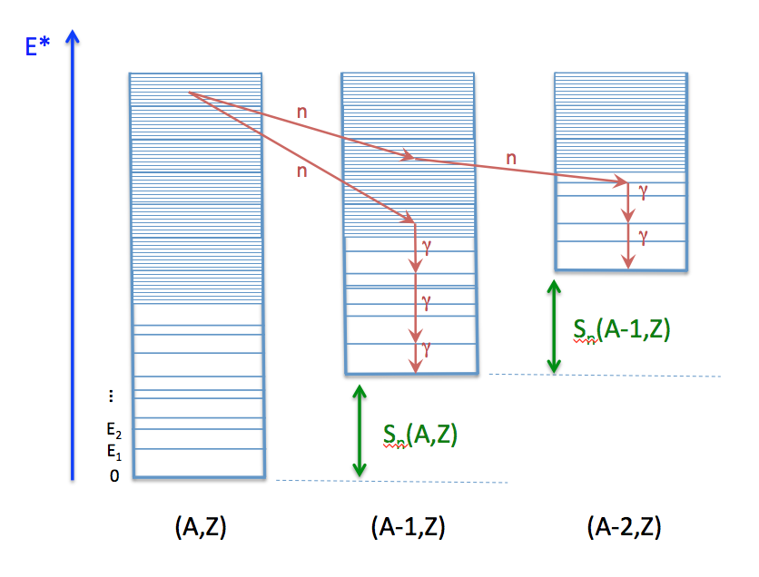

Hauser-Feshbach Statistical Decay
=================================

The Hauser-Feshbach theory `(Hauser-Feshbach,1952) <http://journals.aps.org/pr/abstract/10.1103/PhysRev.87.366>`_ describes the decay of a compound nucleus in statistical equilibrium through the evaporation of particles and photons until a ground-state or long-lived isomer is reached. This is schematically represented in Fig. 2.6.

.. _fig_diagram:

   Schematic drawing explaining the representation of a nucleus in the :program:`CGMF` code, and individual decay paths followed through Monte Carlo simulations.

In this schema, a fragment :math:`(A,Z)` is represented by its ground-state at energy zero, a set of low-lying discrete excited states, and by a set of energy-bins at higher excitation energy where the density of levels becomes too high for individual levels to be separated experimentally. In practice, this picture is not a clear-cut between resolved and unresolved levels. Some levels may have been identified above the continuum threshold region, but it may also be known, from a statistical analysis of the observed levels, that a significant portion of levels has not been observed or that a large fraction of observed levels could not be assigned a specific spin or/and parity. In this case, the matching energy between the discrete and continuum regions is often lowered to well-known levels. 

Fission fragments are neutron-rich, and often relatively far from the valley of :math:`beta`-stability where most experiments have been performed. The known spectroscopy of neutron-rich nuclei is very poor compared to stable nuclei, which means that often very few discrete levels are known. In this case, the matching of the discrete region to the continuum is complicated and very sensitive to the number of specific levels included in the analysis. One also has to rely on systematics of level density parameters to describe the continuum region. Those systematics have been established for stable nuclei and large uncertainties can be expected in the description of nuclei far from stability.

In Fig. 2.6, a couple of decay paths, starting from the same initial excitation energy-bin, are drawn (red arrows) to illustrate the emission of neutrons and photons. In a traditional deterministic Hauser-Feshbach reaction code, the daughter nuclei are all populated at the same time. In a Monte Carlo code such as :program:`CGMF`, only one path is chosen at a given step.

The Hauser-Feshbach theory is statistical in nature and the decay paths are governed by the probabilities for the system to evolve in a particular reaction channel that is open, i.e. physically possible given constraints in energy, spin and parity. We will denote a channel :math:`c` by:

.. math::

	c \equiv (A_i,Z_i,U_i,J_i,\pi_i;A_f,Z_f,U_f,J_f,\pi_f)

In the case of neutron or photon emissions only, we always have :math:`Z_i=Z_f`, and :math:`A_i=A_f` (photon) or :math:`A_f=A_i-1` (neutron).

The probability of decaying through a particular channel :math:`c` is given by the product of the channel transmission coefficients and the density of levels in the final state. For photons, we have:

.. math::

	P(\epsilon_\gamma) dE \propto T_\gamma(\epsilon_\gamma) \rho(Z,A,E-\epsilon_\gamma)dE,

and for neutrons

.. math::

	P(\epsilon_n) dE \propto T_n(\epsilon_n) \rho(Z,A-1,E-\epsilon_n-S_n)dE,

where :math:`\epsilon_\gamma` and :math:`\epsilon_n` are the center-of-mass energies of the emitted photon and neutron, respectively.

