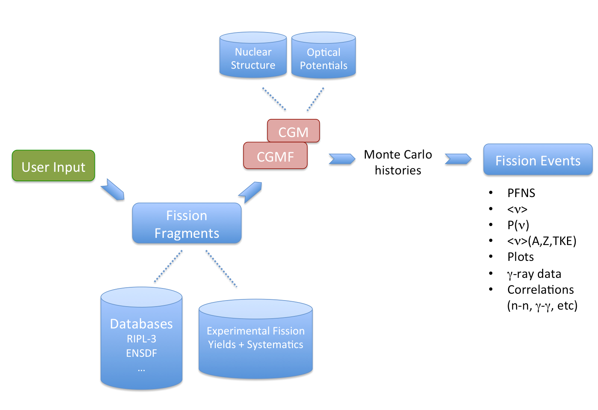

************
Code Details
************

The :program:`CGMF` code is written in C++. It is built around the :program:`CGM` Monte Carlo statistical Hauser-Feshbach code, which provides the main computational methods for following the decay of the excited fission fragments. Two additional classes have been written out of the :program:`FFD` code to prepare and sample the initial fission fragments, and to read out and analyze the Monte Carlo histories that are generated.

Code Organization & options
===========================

``cgmf.cpp`` is the main driver of the code. It first reads in the user input parameters, and calls other routines from different classes to perform the requested calculations. 

Algorithm
---------

Here we describe the basic algorithm of ``cgmf.cpp``.

First, the user input provided at the command line is parsed, and analyzed. The ``ZAIDt`` and ``Einc`` input parameters are mandatory. Note that some options available in :program:`CGM` are now set fixed and hardwired for their use in :program:`CGMF`.

**Reading a history file**

If the ``-r`` option is given, then the code reads a history file containing an ensemble of Monte Carlo histories previously generated by :program:`CGMF`. In the case of large files, it is possible to add the ``-n`` option to provide a smaller number of events to be read and analyzed. In this case, the basic algorithm of the code is as follows::

	fissionEvents = new FissionEvents (nevents);
   	fissionEvents->setZAIDcn (ZAIDt, Einc);
 	fissionEvents->readHistories (historyFile, nevents);
	fissionEvents->analyzeResults ();
	fissionEvents->computeFinalResults();

Note that all the methods used above only make use of the class ``fissionEvents.cpp/.h``. A number of events (``nevents``) are read from the Monte Carlo history file using ``readHistories()``, and they are analyzed in ``analyzeResults()``. In this method, the characteristics of the fission fragments, the prompt neutrons and the prompt photons are stored in various histograms, e.g., ``particles->Pnu[]``, ``particles->nuTKE[]``, etc, where ``particles`` is a pointer to an ``emittedParticleType``, which can be either neutrons or photons.

Finally, the method ``computeFinalResults()`` is used to transform histograms into average quantities, distributions and correlations among different physical quantities. For instance, the fission fragment yields are calculated and stored under ``YA[]``, ``YApost[]``, ``YZ[]``, ``YTKE[]``, ``YUl[]``, etc. Prompt fission neutron and photon spectra are calculated from the original histograms and transformed onto the outgoing energy grid ``SPECTRUM_ENERGY_GRID`` defined in the ``init()`` method in ``FissionEvents.cpp``.

**Performing Monte Carlo Simulations**

In the more general case where one wants to perform Monte Carlo simulations of the decay of the fission fragments, the algorithm is as follows:

First, a new instance of ``FissionFragments`` is created to initialize the fission reaction parameters and files::

	ff = new FissionFragments ();

Next, instances of light and heavy fragments are created with the total number of Monte Carlo events ``nevents`` specified by the user::

	lightFragments = new fissionFragmentType [nevents];
	heavyFragments = new fissionFragmentType [nevents];

These objects are used to track all information pertinent to each of the fragments for each fission event.

Next, a set of ``nevents`` fission events are produced::

	ff->generateInitialFissionFragmentHistories (lightFragments, heavyFragments, nevents);

This call produces all the initial characteristics :math:`(A,Z,KE,U,J,\pi)` for each fission fragment in each fission event.

What follows is the main loop of the program, going over every fission event and performing the de-excitation of each fission fragment::

  // -- BEGIN LOOP OVER FISSION EVENTS ----------------------------------------
  for (int ievent=0; ievent<nevents; ievent++) {
    lf = lightFragments[ievent];
    hf = heavyFragments[ievent];
    fissionEvents->addFragments (lf, hf);
    specMCMain (lf.spin, lf.parity, 0.0, 0.0, 1, spc); // light fragment calc.
    specMCMain (hf.spin, hf.parity, 0.0, 0.0, 1, spc); // heavy fragment calc.
  }
  // -- END LOOP OVER FISSION EVENTS -------------------------------------------

``lf`` and ``hf`` are pointers to the light and heavy fission fragment partners for the fission event ``ievent``. The ``addFragments(lf,hf)`` method is used to record the characteristics of this particular fission event. Next is the main :program:`CGM` computational method ``specMCMain()``, which performs the Monte Carlo Hauser-Feshbach calculations of the decay of this particular excited nucleus. ``specMCMain()`` is called twice, once for each fragment. A description of this method is given below.

Past this main loop, the Monte Carlo histories are recorded in an output file::

	fissionEvents->writeHistories ("histories.CGMF");
 
and the results analyzed with::
 
	fissionEvents->analyzeResults ();  
	fissionEvents->computeFinalResults();

This last section of the code is identical to the one used after reading a Monte Carlo history file, as explained above.

User Options
------------

The user options, given at the command line, are as follows:

* ``-i ZAIDt`` : ZAID (1000*Z+A) of the target nucleus, or fissioning nucleus in the case of spontaneous fission. [required]
* ``-e Einc``  : energy of the incident neutron (in MeV). For spontaneous fission, set to 0.0. [required]
* ``-n nevents`` : number of Monte Carlo events [default: 1,000,000]
* ``-r historyFile`` : to read and analyze a Monte Carlo history file already produced by :program:`CGMF`
* ``-h``: display the help page for :program:`CGMF`

Note: other options are available, but won't be described in this release of the code and user manual.

If ``nevents`` is negative, then only the pre-neutron emission fission fragment yields :math:`Y(A,Z,KE,U,J,\pi)` are produced. 

If the ``-r`` option is given, a :program:`CGMF` output file is read and analyzed. This is especially useful when a large output file has been generated and needs to be re-analyzed differently. In this case, the number of events can also be read, and smaller samples of the entire file can be used instead. 

Configuration File(s)
---------------------

:program:`CGMF` comes with two configuration files, one inherited from the :program:`CGM` code and one required specifically for fission calculations. In this manual, we describe the settings that are relevant to the fission fragment decay calculations only. 

**config.h**

The ``config.h`` file is inherited from :program:`CGM`, but with some added options. Important variables are as follows::

	#define  DATADIR   "/usr/local/share/cgmf"

defines the path to the data libraries used for the Hauser-Feshbach calculations and for the initial fission fragment yields. This directory contains the RIPL-3 library of discrete levels available for many nuclei, and level density parameter systematics that are needed for fragments with unknown nuclear structure. This path should be changed by the user to reflect his/her own local data structure.::

	const double ENERGY_BIN = 0.05;  // 50 keV

This constant defines the width of the energy-bin (in MeV) used in the continuum representation of the nuclear levels. A smaller value would provide a finer energy grid for the gamma-ray transitions in the continuum. For instance, if this quantity is set to 50 keV, then the minimum energy for the gamma transitions in the continuum would be 50 keV as well. Reducing this value will provide a continuum photon spectrum for energies below 50 keV, but could dramatically increase the computation time. A larger value would significantly speed up the calculations, but would cut the lower-energy part of the photon spectrum.::

	const double CONTINUUM_LOWER_CUT = 0.02;

A problem inherent to all Hauser-Feshbach-type codes is the matching between the continuum and the discrete level regions describing the structure of a nucleus. The continuum region is defined by an ensemble of energy bins and a level density distribution :math:`\rho(U_{bin},J,\pi)` for each energy bin. On the other hand, at lower energies, the nucleus is assumed to be fully characterized by a set of discrete levels with specific energies, spins and parities. In the course of following the decay of an excited nucleus, one sometimes populates a certain continuum energy-bin at low excitation energy, but with a high spin. The decay to this continuum state to a lower discrete level with much lower spin is strongly hampered, and can lead to an artificial series of low-energy :math:`E1` transitions in the continuum until a more probable low-spin transfer transition becomes available. This result is not physical. To reduce the impact of this effect, we have introduced the quantity ``CONTINUUM_LOWER_CUT`` to eliminate any transition below this energy.

We do not encourage users to modify this quantity, unless they know exactly what they are doing. We are working on a better solution to this problem. ::

	const bool INCLUDE_INTERNAL_CONVERSION = true;

This boolean is set to TRUE if one wants to include the internal conversion transitions into the decay of the fragments. ::

	const bool RANDOM_SEED_BY_TIME = true;

This boolean can be set to FALSE if one wants to fix the initial seed of the pseudo-random number generator used for the Monte Carlo samplings. This is useful in testing the reproducibility of the results, but should be set to TRUE in actual calculations.

::

	const double EXPERIMENTAL_TIME_WINDOW = 1.0e-8; // 10 ns

This value should correspond to the experimental time coincidence window used to define the prompt fission data recorded in coincidence with a fission event. In the example above, this value is set to 10 ns. The probability of continuing a gamma cascade from an isomeric state will then depend on the value of the time window and the half-life of this isomeric state. By default, this constant is set to a negative value so that all cascades are followed until they reach the ground-state of a fission product.

**config-ff.h**

The ``config-ff.h`` is an additional configuration file, specific to fission fragment decay calculations. ::

	#define MPIRUN
	// #undef MPIRUN

:program:`CGMF` can be run using MPI parallel instructions on a multi-processor machine. This can be done by commenting out the ``#define MPIRUN`` directive and recompiling the code. Using ``#undef MPIRUN`` instead would generate a non-MPI executable that is suitable to a one-processor machine.

What follows is a set of constants that define the sizes of arrays used throughout the code::

	const int    NUMA   =  300; // number of masses A
	const int    NUMZ   =  100; // number of charges Z
	const int    NUMTKE =  300; // number of Total Kinetic Energy values

	const int      NUME =  401; // number of energies in level density tables;
                                    // dE=0.25 MeV; up to Emax=100 MeV
	const double deltaE = 0.25; // energy-bin size used in level density tables

	const int    NUMdZ  =   21; // [-dZ:+dZ] if dZ=10 for charge distribution
                                    // around most probable Zp[A] 

	const int   NUMMULT =   50; // number of multiplicities

	const int NUMANGLES =   73; // number of angles in angular distribution
	const double dTheta =  2.5; // angular bins (degrees)

	const int MAX_NUMBER_PARTICLES = 50; // max. number of particles (n or g)
                                             // emitted per fragment in a fission event

	const int NUMBER_SPECTRUM_ENERGY_GRID = 641; //551;

Note that **none of those settings should be changed**, except by an informed user. 

Important Classes & Methods
===========================

.. note::

   This section needs to be updated to include the incident neutron energy dependence up to 20 MeV.

Class ``FissionFragments.cpp``
------------------------------

This class provides all the methods and variables needed to produce the initial fission fragment yields, prior to neutron emission, characterized by a mass :math:`A`, a charge :math:`Z`, a kinetic energy :math:`KE`, an excitation energy :math:`U`, a spin :math:`J`, and a parity :math:`\pi`. The constructor is declared as::

	FissionFragments::FissionFragments (int ZAID, float Einc, double alphaSpin);

In input, the user has to provide:

	* the ``ZAID`` of the fissioning nucleus, i.e., :math:`1000 \times Z + A` that uniquely identifies a nucleus,
	* the energy of the incident neutron, ``Einc``, which should be given in MeV. In the case of spontaneous fission, 0.0 should be given.
	* ``alphaSpin``, which is a multiplying factor entering in the initial spin distribution of the fission fragments. Default is 1.0, which means that the original level density spin distribution for the fragments is used.

The constructor then calls the methods ``setOptions()`` and ``init()``. The first method sets options that completely characterize the fission fragment yields :math:`Y(A,Z,TKE)` from partial experimental data and some systematics. It also defines the type of energy sorting mechanism allowed by the code.

.. note::

  Below the threshold for the 2nd-chance fission, only one set of fission fragment yields have to be constructed at a particular excitation energy. At higher energies, the situation is much more complicated, as the pre-fission neutron spectrum, which includes evaporation and pre-equilibrium components, has to be sampled, leading to a residual nucleus :math:`(A_c-\nu,Z_c,E_{res})` that can then fission. The yields are therefore constructed "on-the-fly" while generating fission events.

The ``init()`` method then creates the fission fragments as::

    fragments = new Nucleus[2];

where ``Nucleus`` is a class that fully describes a nucleus. In particular, it constructs the nuclear structure defined by a set of known low-lying discrete
levels, read from the RIPL-3 database, and produces a continuum of energy bins above a certain matching energy. It also reads in nuclear masses, ground-state deformations, and individual decay transitions that are present in the database.

Class ``FissionEvents.cpp``
---------------------------

The class ``FissionEvents.cpp`` provides objects and methods to read and analyze the Monte Carlo histories produced by :program:`CGMF`. The constructor::

	FissionEvents::FissionEvents (int maxNumberEvents) { init(maxNumberEvents); }

simply calls an initialization method with the maximum number of events to read and analyze. The ``init()`` method initializes several objects and variables: it first instantiates the objects::

	lightFragments = new fragmentEventType [maxNumberEvents];
	heavyFragments = new fragmentEventType [maxNumberEvents];

with the size of ``maxNumberEvents``. 

A ``fragmentEventType`` is a structure that fully characterizes a fission fragment event::

	struct fragmentEventType {
 	  int    A, Z;
  	  double KE;  // kinetic energy (MeV)
  	  double Ui;  // initial excitation energy (MeV)
  	  int    Pi;  // initial parity
  	  double Ji;  // initial spin
	  emissionType emissions[3]; // neutrons [0], gammas [1] and internal conversion [2]
	};

where the ``emissionType`` objects are themselves defined as::

	struct emissionType {
	  int multiplicity;
	  double cmEnergies   [MAX_NUMBER_PARTICLES];
	  double labEnergies  [MAX_NUMBER_PARTICLES];
	  double cmAngles     [MAX_NUMBER_PARTICLES];
	  double labAngles    [MAX_NUMBER_PARTICLES];
	  int transitionTypes [MAX_NUMBER_PARTICLES];
	};

and fully defines a particular emission in energy, angle in both the center-of-mass and laboratory frames, and type of emission, e.g., neutron, gamma or internal conversion.

The ``lightFragments`` and ``heavyFragments`` objects are then used to store all fission event data for the total number of events (``maxNumberEvents``).

The initialization subroutine also defines the outgoing energy grid used to report the particle energy spectra. It finally initializes several storage arrays.

The following method::

	void FissionEvents::addFragments (fissionFragmentType lf, fissionFragmentType hf) {...};

is used to save all the data pertaining to the fission fragments :math:`(A,Z,KE,U,J,\pi)` in a fission event, for both complementary fragments.

The decay of the fission fragments is handled by the routine ``specMCMain()`` (described below). Once all Monte Carlo samplings have been performed,  the results are then saved into a history file by::

	void FissionEvents::writeHistories (string outputFilename) {...};

This routine simply takes an filename in input, opens the file for writing, and writes all the Monte Carlo histories onto it. The resulting file can later be read and analyzed using the method::

	void FissionEvents::readHistories (string inputFilename, int numberEvents) {...};

The next step is to analyze the results. This is done through::

	void FissionEvents::analyzeResults (void) {...};

This routine loops over all fission events, and fills out many variables and arrays, such as ``particles->lfEcm``, which records the center-of-mass energies of the emitted neutrons and photons coming from the light fragment, ``particles->nuTKE[iTKE]``, which records the average particle multiplicity as a function of the total kinetic energy, ``gammaMultiplicityNu[]``, which records the gamma-ray multiplicity versus neutron multiplicity correlations, etc. 

Note that if :program:`CGMF` is run with MPI parallel instructions, then ``MPI_Reduce()`` calls are made here.

Another routine::

	void FissionEvents::computeFinalResults (emittedParticleType * particles) {...};

is used to finalize the results by transforming histograms into spectra, renormalizing yields, calculate different average quantities as a function of fragment properties, etc. Those two last routines may be merged in a future (cleaner) version of the code.

Finally, results can be saved in a format that is custom-readable by GNUPLOT scripts through::

	void FissionEvents::saveResultsToGnuplot () {...};

Method ``specMCMain()``
-----------------------

This method is at the core of :program:`CGM/F` calculations. It performs Monte Carlo samplings of emission probabilities for all open channels following the Hauser-Feshbach [Hauser-Feshbach:1952]_ statistical formalism of nuclear reactions. For every initial configuration of a compound nucleus :math:`(A,Z)` in excitation energy :math:`U`, spin :math:`J` and parity :math:`\pi`, it prepares the nucleus by reading its known low-lying structure from the RIPL-3 database, prepares its continuum energy-bins, and compute the neutron and photon transmission coefficients. It does this for a certain number of nuclei that can be produced in multiple neutron emissions. 

The method then samples the emission probability distributions, and choses one particular decay path. It records the Monte Carlo histories through ``recordEmittedParticles()`` for further reading and analysis by :program:`CGMF`.

