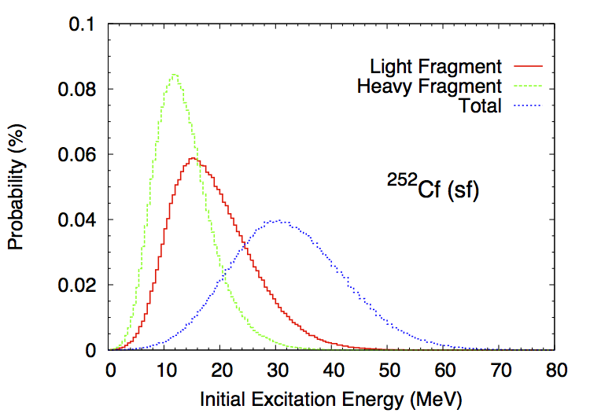

Initial Excitation Energy, Spin and Parity Distributions
========================================================

The total excitation energy (:math:`TXE`) available to the two fragments is constrained by the energy conservation rule

.. math::
   :nowrap:
   :label: TXE

	\begin{eqnarray}
  	TXE &=& Q_f - TKE, \\
      	&=& E_{inc}+B_n+M_n(A_f,Z_f)c^2 - M_n(A_1,Z_1)c^2 - M_n(A_2,Z_2)c^2 - TKE \nonumber
  	\end{eqnarray}

where :math:`TKE` is the total kinetic energy, i.e. the sum of the kinetic energies of fragment 1 and fragment 2, and :math:`M_n` are the nuclear masses for the fissioning nucleus, and the fragments 1 and 2 respectively. Once :math:`TKE` is known, the total excitation energy :math:`TXE` is also known. However, the partitioning of this energy between the two fragments is a more complicated matter, which is discussed at more length in the section below.

Excitation Energy Partitioning
------------------------------

As mentioned above, the total excitation energy (:math:`TXE`) is known as long as the total kinetic energy (:math:`TKE`) and nuclear masses are known. What is not completely known however is the way :math:`TXE` is distributed among the light and the heavy fragments.

Several interesting and competing ideas have been proposed to explain how :math:`TXE` is shared among the two fragments `(Schmidt,2010) <http://journals.aps.org/prl/abstract/10.1103/PhysRevLett.104.212501>`_ `(Talou,2011) <http://journals.aps.org/prc/abstract/10.1103/PhysRevC.83.064612>`_, but no fully compelling proof has been given so far supporting those theories. They all rely on some assumptions regarding the configurations of the fission fragments near the scission point. In the present version of :program:`CGMF`, this excitation energy partitioning is treated as a free parameter, which can be tuned to be best reproduce the average prompt fission neutron multiplicity as a function of the fragment mass, :math:`\overline{\nu}_p(A)`. Indeed, to the first order, the neutron multiplicity reflects the excitation energy of the fragment, while the average neutron energy reflects the temperature of the fragment.

We introduce the ratio of the temperatures between the light and heavy fragments:

.. math::
  :label: RT

  R_T=\frac{T_l}{T_h},

and use the Fermi gas formula to infer the sharing of the excitation energy. This ratio parameter depends on the fragment pair masses :math:`A_l` and :math:`A_h`. At this stage, it is only a convenient way to parameterize the partitioning of :math:`TXE`, and nothing more. Note that this parameter can also be confusing as it uses a ratio of temperatures, while its correct purpose is to share excitation energies. It was introduced at first in the context of the Los Alamos model (LAM) `(Madland,1982) <http://www.ans.org/pubs/journals/nse/a_20086>`_ to compute the average prompt fission neutron spectrum. In its original formulation, the LAM uses a distribution of temperatures to represent the intrinsic excitations in the fragments, and uses the same distribution for both the light and the heavy fragments. In other words, :math:`R_T=1.0`. 

In :program:`CGMF`, :math:`R_T` can be chosen to be mass-dependent to best reproduce :math:`\overline{\nu}_p(A)`. In most cases, it means that :math:`R_T>1.0` as more excitation energy is pumped into the light fragment at the expense of the heavy fragment. This result is in large part due to the deformation energies of the nascent fragments, the heavy fragment being closer to a sphere thanks to shell closures, while the light fragment is largely deformed. This is not true everywhere however, and for very asymmetric fragmentations the inverse becomes true.

We are working on a more physically and mathematically sound proof of this empirical result, in particular in order to expand :program:`CGMF` calculations to other isotopes and energies more reliably.

Figure fig-Ui_ shows an example of a distribution of initial excitation energies in the light and heavy fragments, as well as the total energy, in the case of Cf-252 spontaneous fission.

.. _fig-Ui:

   Typical initial excitation energy distributions in the light and heavy fragments, as well as the total, computed in the case of Cf-252 spontaneous fission.

Spin and Parity Distributions
-----------------------------

The spin of the fragments also follows a conservation rule

.. math::
  :label: spin

  \vec{J_1}+\vec{J_2}+\vec{l}=\vec{J_f}

where :math:`\vec{J_1}` and :math:`\vec{J_2}` are the fission fragment total spins, :math:`\vec{J}` is the total angular momentum of the fissioning nucleus, and :math:`\vec{l}` is the relative orbital angular momentum between the two fragments. In the present version of :program:`CGMF`, :math:`\vec{J_1}` and :math:`\vec{J_2}` follow a Gaussian distribution around a mean value that is chosen to best reproduce some of the observed prompt photon characteristics. The relative orbital angular momentum :math:`l` is left free, so there is no correlation between :math:`\vec{J_1}` and :math:`\vec{J_2}` at this point. This question will be revisited in future versions of the code. Also, negative and positive parities are chosen to be equally probable, so the spin and parity distribution in the fragments reads

.. math::
  :label: JpiDistribution

  \rho(J,\pi) = \frac{1}{2}(2J+1) \exp \left[ -\frac{J(J+1)}{2B^2(Z,A,T)} \right]

where :math:`B` is defined in terms of the fragment temperature as

.. math::

   B^2(Z,A,T)=\alpha\frac{\mathcal{I}_0(A,Z)T}{\hbar^2},

and :math:`\mathcal{I}_0(A,Z)` is the ground-state moment of inertia of the fragment :math:`(A,Z)`. :math:`\alpha` is an adjustable parameter that is used globally to reproduce prompt fission :math:`\gamma` data.

Typical values calculated for the light and heavy fragments are 6-8 :math:`\hbar`, in rather good agreement with values cited in the literature-- see `(Wilhelmy,1972) <http://journals.aps.org/prc/abstract/10.1103/PhysRevC.5.2041>`_ for instance.

