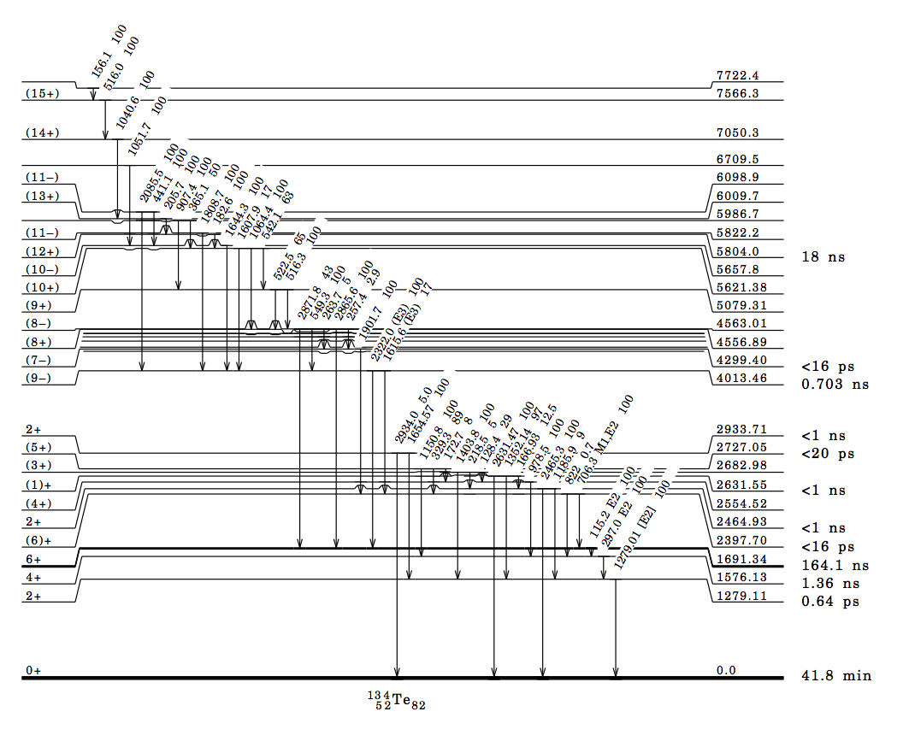

Isomeric States
===============

Many low-lying discrete levels that are reported in the ENSDF database have a measurable half-life, ranging from nanoseconds to seconds and even longer. :program:`CGMF` takes this into account when calculating the gamma cascades in the fission products, and samples the exponential decay law according to the reported half-lives. 

An experimental time coincidence window can be set in the ``config.h`` configuration file::

	const double EXPERIMENTAL_TIME_WINDOW = 1e-8;

The time is given in seconds, so in the example above, 1e-8 corresponds to 10 ns. The default value is negative. In this case, all levels are set to decay to the ground-state, ignoring half-lives entirely. Since this value is stored in a configuration file, it is set at compilation time. If the user decides to change this value, he/she would need to recompile the code before using it.

As an example, the calculated intensities for specific gamma lines in Te-134, in the thermal neutron-induced fission of U-235, are shown in the figure below. Time-coincidence windows of 10, 100 and 300 ns were used in three separate calculations. Because of the presence of ~100 ns isomers in Te-134, some of these lines are more or less prominent depending on their half-lives. For example, the :math:`6^+` state at 1.691 MeV has a half-life of 164 ns, decaying to the :math:`4^+` state at 1.576 MeV. A too-short time gate (e.g., 10ns) cannot record this particular gamma line at 115 keV. Similarly, the decay of the :math:`4^+` to :math:`2^+` (297 keV) is also hindered since it depends on the decay of the higher excited :math:`6^+` state.

.. image:: _static/images/isomers.png
   :width: 45%
   :align: right
