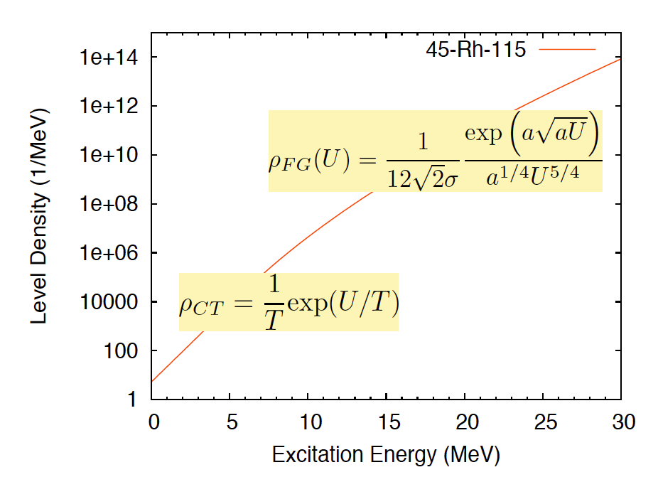

Continuum Level Densities
=========================

In :program:`CGMF`, the `Gilbert-Cameron <http://www.nrcresearchpress.com/doi/10.1139/p65-139#.WqB0547eqZo>`_ model of level densities is used for all fragments. In this model, a constant temperature formula is used to represent the level density at lower excitation energies, while a Fermi gas formula is used at higher excitation energies. Experimental data on the average level spacing at the neutron separation energy can be used to constrain parameters entering the Fermi gas formula, while low-lying discrete levels are used to constrain the constant-temperature parameters. Again, little data is available for nuclei far from stability where systematics have been developed, contribution to uncertainties in the final predicted data.

The constant temperature form is given by

.. math::

	\rho_{CT}(U)=\frac{1}{T}{\rm exp}\left( \frac{U+\Delta-E_0}{T} \right),

where :math:`T` is the nuclear temperature and :math:`E_0` is a normalization factor. The quantity :math:`U` is the excitation energy :math:`E` minus the pairing energy :math:`\Delta`. At higher excitation energies, the Fermi gas form of the level density is used instead and is given by

.. math::

	\rho_{FG}(U)=\frac{{\rm exp}\left( 2\sqrt{aU}\right)}{12\sqrt{2}\sigma(U)U(aU)^{1/4}},

where :math:`a` is the level density parameter. The constant temperature form of the level density is matched to cumulative low-lying discrete levels, when they are known. For fission fragments, which are neutron-rich and rather poorly known, this constant-temperature level density is sometimes used down to the ground-state, as shown in the following figure

.. _fig_LD:

In its original formulation, the Gilbert-Cameron formalism uses an energy-independent level density parameter :math:`a`. To better describe the washing-out of shell effects at higher excitation energies, Ignatyuk `(Ignatyuk,1979) <https://inis.iaea.org/search/search.aspx?orig_q=RN:11512726>`_ developed a model that uses an energy functional for the level density parameter as

.. math::

	a(U) = \tilde{a} \left( 1+\delta W \frac{1-{\rm exp}(-\gamma U)}{U} \right).

In this formula, :math:`\tilde{a}` is the asymptotic value of the level density parameter at high energy, :math:`\delta W` is the shell correction energy, and :math:`\gamma` is an empirical damping width to account for the washing-out of shell effects at high energy.
