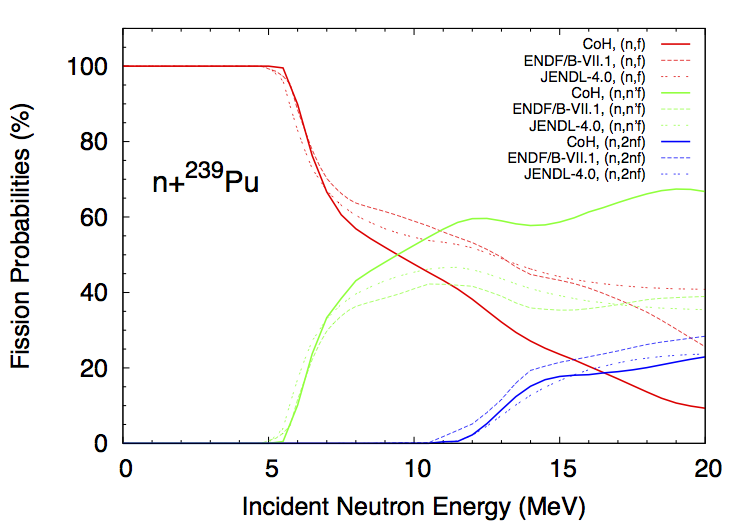
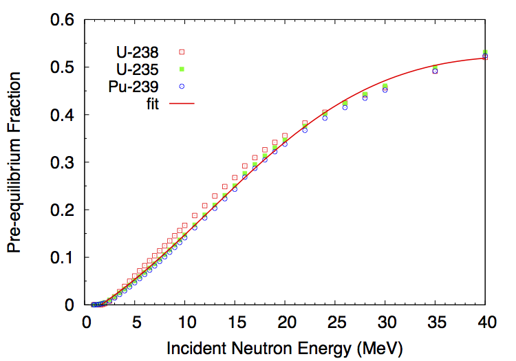

Neutron Emission Probabilities
==============================

Neutron transmission coefficients :math:`T_n^{lj}(\epsilon)` are obtained through optical model calculations. In this model, the Schroedinger equation describing the interaction of incoming waves with a complex mean-field potential is solved, providing the total, shape elastic and reaction cross-sections. It also provides the transmission coefficients that are used in the compound nucleus evaporation calculations.

The transmission coefficients for a channel :math:`c` are obtained from the scattering matrix :math:`S` as

.. math::
	
	T_c=1-\left|\langle S_{cc}\rangle \right|^2.

To calculate the neutron transmission coefficients for fission fragments, it is important to rely on a global optical model potential (OMP) that can provide results for all nuclei. By default, :program:`CGMF` uses the `global spherical OMP of Koning and Delaroche <https://www.sciencedirect.com/science/article/pii/S0375947402013210>`_.

It is important to note that the calculated spectrum of prompt neutrons does depend on the choice of the optical potential used to compute the neutron transmission coefficients. The OMP of Koning-Delaroche has been established to describe a host of experimental data, e.g., total cross-sections, :math:`S_0` and :math:`S_1` strength functions, etc. However, those data are only available for nuclei near the valley of stability. Some experimental information do indicate that this optical potential may not be very suitable to the fission fragment region, and therefore a relatively large source of uncertainty in the calculation of the neutron spectrum results from this open question.

Pre-Fission Neutrons
--------------------

If the initial excitation energy in the compound nucleus is high enough, there is a chance that neutrons are evaporated prior to fission. We then talk about first-chance :math:`(n,f)`, second-chance :math:`(n,n'f)`, third-chance :math:`(n,2nf)`, etc., fissions. The probabilities for each multi-chance fission event to occur can be computed from the :math:`\Gamma_n/\Gamma_f` ratio as a function of the incident neutron energy. This ratio depends in turn on the fission barrier heights in the various compound nuclei :math:`A, A-1, A-2`, etc. The :program:`CoH-3.0.4` code was used to calculate those ratios for different actinides. As an example, we show here the case of n+Pu-239, in comparison with ENDF/B-VII.1 and JENDL-4.0 evaluations. The :program:`CoH` calculations tend to predict a much higher second-chance fission probability at the expense of the first-chance, compared to the evaluations. These quantities are not observables though, and it is therefore difficult to judge about the validity of those curves at this point.

  Multi-chance fission probabilities in the neutron-induced fission reaction on Pu-239 as calculated with the :program:`CoH` code (and used in :program:`CGMF`), and in comparison with the ENDF/B-VII.1 and JENDL-4.0 evaluations.

In :program:`CGMF`, those multi-chance fission probabilities are sampled to determine the number of pre-fission neutrons. Then, the energies of those neutrons are obtained by sampling the corresponding neutron spectra. In the case of the first emitted neutron, the spectrum corresponds to a weighted sum of a pre-equilibrium and an evaporation components. The fraction of pre-equilibrium neutrons is also calculated in the :program:`CoH` code using the exciton model. Then, the first neutron-out spectrum is given by:

.. math::

  \chi_1 = f_{pe}\chi_{pe}+(1-f_{pe})\chi_{evap}.

The energy-dependent fraction :math:`f_{pe}` can be fitted by a simple function:

.. math::

  f_{pe}(E_{inc}) = \frac{1}{1+\exp\left[ (12.49-E_{inc})/10.21 \right]}-0.042 E_{inc} -0.25.

As can be seen in Fig. fig-PE_, it is a very reasonable approximation for neutron-induced reactions on U-235, U-238 and Pu-239.

.. _fig-PE:

  Pre-equilibrium fractions calculated with the :program:`CoH` code. There is only a slight dependence on the target nucleus, and the fit formula (solid line) is used by default in :program:`CGMF` instead.